<p align="center">
  
</p>

<h1 align="center">Ghost-Score-Driven Multi-Pipeline Face Swap</h1>

<p align="center">
  <strong>3D-aware visible-surface compositing, ghost-score routing, and Apple-Silicon-native runtime</strong>
</p>

<p align="center">
  <a href="https://doi.org/10.5281/zenodo.20179682">
    
  </a>
  
  
  
  
</p>

<p align="center">
  <a href="#what-this-project-does">Overview</a> ·
  <a href="#research-paper">Paper</a> ·
  <a href="#research-figures">Figures</a> ·
  <a href="#installation">Installation</a> ·
  <a href="#usage">Usage</a> ·
  <a href="#benchmark-results">Results</a> ·
  <a href="#ethics">Ethics</a>
</p>

---

## What This Project Does

This repository contains a local face-swap research prototype that combines three complementary pipelines:

| User mode | Internal mode | Core idea | Best use |
|---|---:|---|---|
| Classical Compositing | `photoshop` | InSwapper base, GFPGAN restoration, source-pixel detail graft, Poisson/Laplacian blending, and target hair/occluder re-composite | Pixel detail and source texture transfer |
| AI Synthesis | `ai` | InSwapper + GFPGAN, without source-pixel grafting | Fast, pose-tolerant synthesis |
| Pro Adaptive | `pro` | Multi-candidate router using `photoshop`, `ai_synthesis`, TPS overlay, and HardPoseReplaceMode | Hard pose, target-identity leakage, occlusion, and recovery cases |

The central scoring primitive is the **ghost score**:

```text
g = cos(result, target) - cos(result, source)
```

Lower is better. A negative score means the output face is closer to the source identity than to the target identity. A positive score means target identity is still leaking through and the router should escalate to stronger recovery.

The runtime is designed for **local execution only**. There is no hosted API, no telemetry, and no cloud inference path.

## Research Paper

The research write-up is published on Zenodo:

- DOI: [10.5281/zenodo.20179682](https://doi.org/10.5281/zenodo.20179682)
- Local paper PDF: [Ghost-Score-Driven Multi-Pipeline Face Swap with 3D-Aware Visible-Surface Compositing and Apple-Silicon-Native Runtime.pdf](paper/Ghost-Score-Driven%20Multi-Pipeline%20Face%20Swap%20with%203D-Aware%20Visible-Surface%20Compositing%20and%20Apple-Silicon-Native%20Runtime.pdf)
- Main LaTeX source: [paper/main.tex](paper/main.tex)
- Benchmark tables and figure data: [paper/figures](paper/figures)

```bibtex
@misc{dey2026ghostscore,
  author    = {Dey, Karan Chandra},
  title     = {Ghost-Score-Driven Multi-Pipeline Face Swap with 3D-Aware
               Visible-Surface Compositing and Apple-Silicon-Native Runtime},
  year      = {2026},
  publisher = {Zenodo},
  doi       = {10.5281/zenodo.20179682},
  url       = {https://doi.org/10.5281/zenodo.20179682}
}
```

## Research Figures

The README now surfaces the main figures, result screenshots, benchmark graphs, and algorithms from the paper in a review-friendly layout.

<table>
  <tr>
    <td width="50%">
      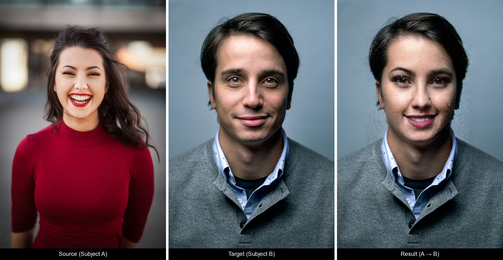<br>
      <strong>Hero triplet.</strong> Source identity is transferred onto the target while preserving target clothing, hair, and background.
    </td>
    <td width="50%">
      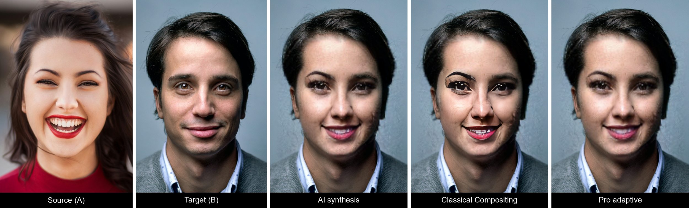<br>
      <strong>Mode comparison.</strong> AI Synthesis, Classical Compositing, and Pro adaptive outputs on the same pair.
    </td>
  </tr>
  <tr>
    <td width="50%">
      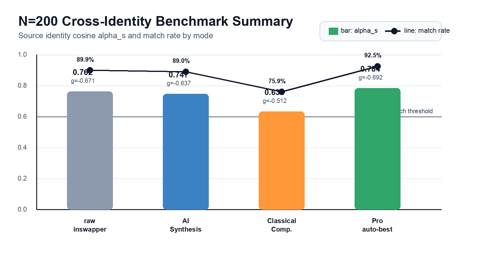<br>
      <strong>N=200 benchmark summary.</strong> Pro reaches the highest aggregate identity match rate.
    </td>
    <td width="50%">
      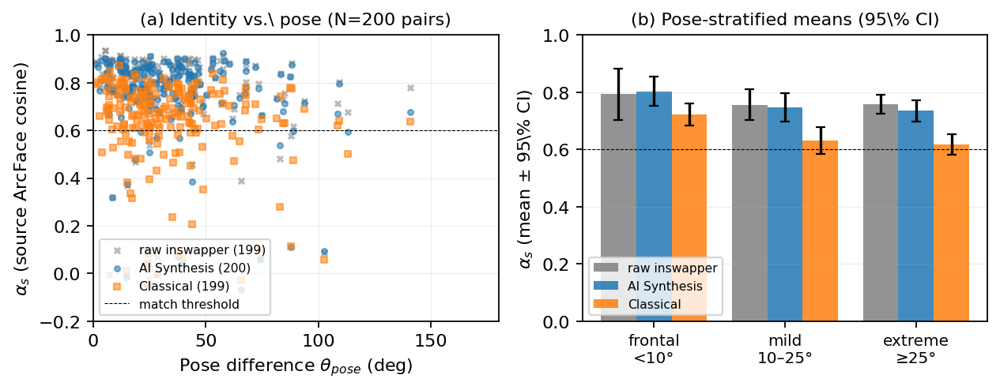<br>
      <strong>Pose robustness.</strong> Identity score is plotted against pose difference with pose-bucket means.
    </td>
  </tr>
  <tr>
    <td width="50%">
      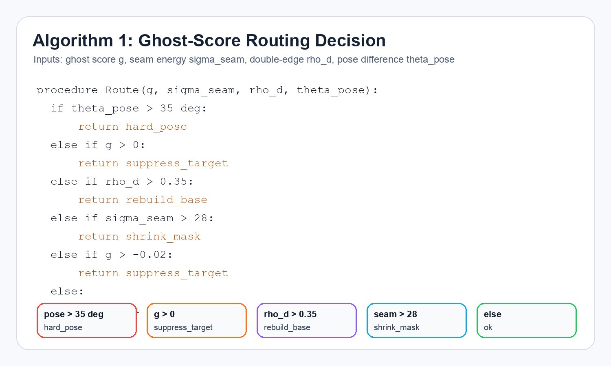<br>
      <strong>Algorithm 1.</strong> Ghost-score routing decision used to select recovery actions.
    </td>
    <td width="50%">
      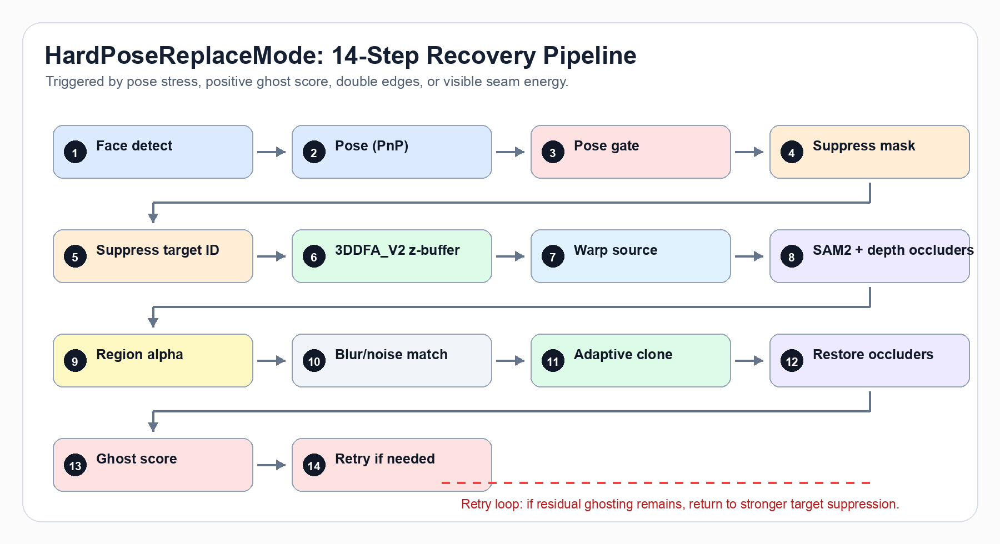<br>
      <strong>HardPoseReplaceMode.</strong> The 14-step recovery path for pose and ghosting failures.
    </td>
  </tr>
  <tr>
    <td width="50%">
      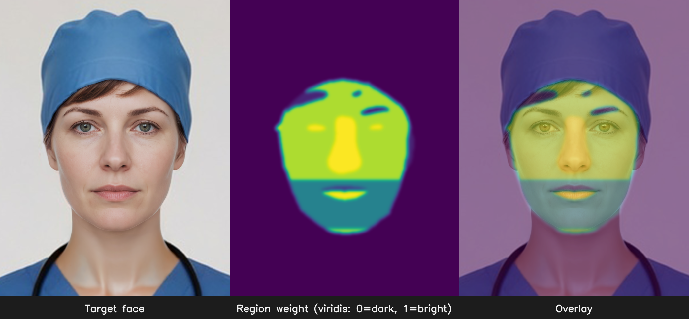<br>
      <strong>Region weights.</strong> BiSeNet-driven per-region alpha map for face parts, hair, and occluders.
    </td>
    <td width="50%">
      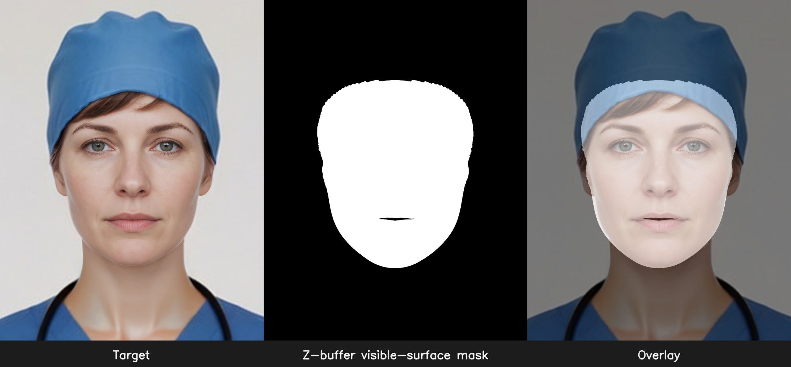<br>
      <strong>Visible-surface mask.</strong> 3DDFA_V2 z-buffer mask rejects self-occluded facial surfaces.
    </td>
  </tr>
  <tr>
    <td width="50%">
      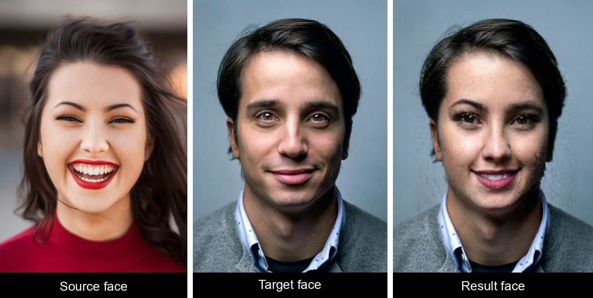<br>
      <strong>Identity crops.</strong> Tight face crops for direct visual inspection.
    </td>
    <td width="50%">
      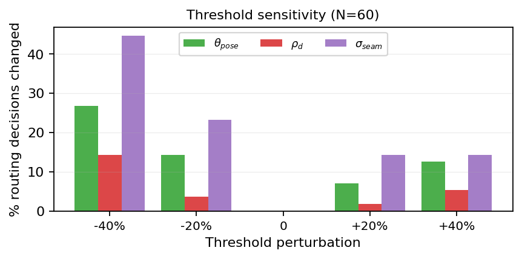<br>
      <strong>Threshold sensitivity.</strong> Routing stability under threshold perturbation.
    </td>
  </tr>
</table>

## Demo

The repository includes a short local UI walkthrough:

<p align="center">
  <a href="docs/demo.mp4">
    
  </a>
  <br>
  <em><a href="docs/demo.mp4">Watch docs/demo.mp4</a></em>
</p>

## Architecture

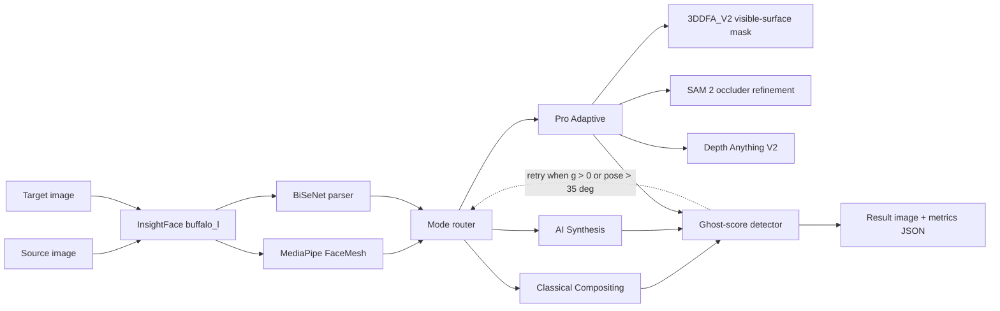

## Benchmark Results

The paper reports a 200-pair cross-identity benchmark using the same InsightFace `buffalo_l/w600k_r50` identity head across rows.

| Mode | Source identity α_s ↑ | Ghost score g ↓ | LPIPS-Alex ↓ | LPIPS-VGG ↓ | Match rate | Median / typical time |
|---|---:|---:|---:|---:|---:|---:|
| Raw InSwapper | 0.762 ± 0.198 | -0.671 ± 0.225 | 0.647 | 0.692 | 89.9% | 1.2 s |
| AI Synthesis | 0.747 ± 0.197 | -0.637 ± 0.263 | 0.638 | 0.687 | 89.0% | 2.3 s |
| Classical Compositing | 0.634 ± 0.185 | -0.512 ± 0.246 | **0.620** | **0.678** | 75.9% | 4.3 s |
| Pro Adaptive | **0.784 ± 0.154** | **-0.692 ± 0.219** | 0.69 | - | **92.5%** | 25.5 s |
| SimSwap-256 baseline | See dual-head discussion in paper | - | - | - | 0.5% under InsightFace head | 0.15 s |

Key paired comparisons from the paper:

- Pro vs Classical: Δα_s = **+0.150 ± 0.031**, Wilcoxon p = **1.2e-21**
- Pro vs AI Synthesis: Δα_s = +0.037 ± 0.032, Wilcoxon p = 6e-3
- Pro vs raw InSwapper: Δα_s = +0.022 ± 0.031, not significant
- Pro on the 10 hardest Classical failures: **10/10 rescued**, mean Δα_s = **+0.732 ± 0.072**

## Installation

### Requirements

| Requirement | Recommended | Minimum / notes |
|---|---|---|
| OS | macOS 14+ on Apple Silicon | Linux can run CPU/ONNX paths, but this repo is tuned on macOS |
| Python | 3.11 | `setup.sh` accepts 3.10, 3.11, or 3.12 |
| RAM | 32 GB unified memory | 16 GB can run smaller inputs |
| Disk | 4-6 GB free after model downloads | More if you keep benchmark outputs |
| GPU | Apple Silicon MPS for GFPGAN | CPU fallback works, slower on full-resolution images |

Install Python on macOS if needed:

```bash
brew install python@3.11
```

Clone and run the one-shot setup:

```bash
git clone https://github.com/Kayariyan28/Ghost-Score-Face-Swap.git
cd Ghost-Score-Face-Swap

chmod +x setup.sh
./setup.sh
```

`setup.sh` performs these actions:

1. Creates `venv/`.
2. Installs pinned Python dependencies from the project stack.
3. Downloads the core model files into `models/`, including InSwapper, GFPGAN, InsightFace `buffalo_l`, and GFPGAN auxiliary parsing weights.

For Pro mode, download the additional 3D/depth/segmentation checkpoints:

```bash
./venv/bin/python download_pro_models.py
```

That fetches the Pro-mode assets under `models/pro/`:

- 3DDFA_V2 ONNX and BFM support files
- Depth Anything V2 small ONNX
- SAM 2 base_plus checkpoint and config

Quick dependency check:

```bash
mkdir -p .cache/matplotlib .cache/fontconfig
NO_ALBUMENTATIONS_UPDATE=1 \
MPLCONFIGDIR=.cache/matplotlib \
XDG_CACHE_HOME=.cache \
./venv/bin/python - <<'PY'
import cv2, insightface, torch, fastapi, skimage, mediapipe
print("runtime imports ok")
PY
```

## Usage

### Web UI

```bash
./run.sh
```

Open [http://localhost:8000](http://localhost:8000).

Workflow:

1. Upload a source portrait.
2. Upload a target image.
3. Choose `Classical Compositing`, `Pro`, or `AI Synthesis`.
4. Adjust HD, enhancement, source detail, identity fidelity, and occluder preservation controls.
5. Run the swap and inspect the result plus metrics.

### HTTP API

`POST /api/swap` accepts multipart form data.

```bash
curl -X POST http://localhost:8000/api/swap \
  -F "source=@path/to/source.jpg" \
  -F "target=@path/to/target.jpg" \
  -F "mode=pro" \
  -F "enhance=true" \
  -F "hd=true" \
  -F "swap_all=false" \
  -F "preserve_hair=true" \
  -F "preserve_source_tone=false"
```

Valid `mode` values:

- `photoshop` - Classical Compositing
- `ai` - AI Synthesis
- `pro` - Pro Adaptive multi-pipeline router

Important form fields:

| Field | Type | Default | Description |
|---|---:|---:|---|
| `source` | file | required | Source identity portrait |
| `target` | file | required | Target image |
| `mode` | string | `photoshop` | `photoshop`, `ai`, or `pro` |
| `enhance` | bool | `true` | Enable GFPGAN restoration |
| `hd` | bool | `true` | Use HD processing path |
| `swap_all` | bool | `false` | Swap all detected target faces |
| `fidelity` | float | `0.75` | AI-mode identity/restoration balance |
| `sharpen` | float | `0.35` | Final unsharp-mask amount |
| `detail` | float | `0.9` | Classical source-detail graft strength |
| `preserve_hair` | bool | `true` | Re-composite target hair, glasses, hats, and accessories |
| `preserve_source_tone` | bool | `false` | Keep source skin tone instead of LAB matching |

Response shape:

```json
{
  "success": true,
  "url": "/outputs/<uuid>.png",
  "metrics": {
    "arcface_cosine": 0.8175,
    "arcface_verdict": "match",
    "ssim": 0.3936,
    "psnr": 8.17,
    "delta_e_mean": 29.54,
    "landmark_rmse_norm": null,
    "elapsed_ms": 21016
  },
  "retried": false,
  "pro": {
    "chosen_route": "photoshop_strong",
    "pose_diff_deg": 17.88,
    "ghost": {
      "arc_to_source": 0.8175,
      "arc_to_target": 0.4342,
      "ghost_score": -0.3833,
      "routing": "ok"
    }
  }
}
```

### CLI

The current CLI is a basic smoke-test wrapper around the default `FaceSwapper.swap()` path.

```bash
./venv/bin/python swap_cli.py path/to/source.jpg path/to/target.jpg outputs/cli_swap.png
```

For mode selection and Pro metrics, use the Web UI, HTTP API, or Python API.

### Python API

```python
import cv2
from face_swap import FaceSwapper
from pro_swap import pro_swap

source = cv2.imread("path/to/source.jpg")
target = cv2.imread("path/to/target.jpg")

swapper = FaceSwapper()

# Classical Compositing
classic = swapper.swap(source, target, mode="photoshop", hd=True, enhance=True)
cv2.imwrite("outputs/classical.png", classic)

# AI Synthesis
ai = swapper.swap(source, target, mode="ai", hd=True, enhance=True)
cv2.imwrite("outputs/ai.png", ai)

# Pro Adaptive
pro = pro_swap(swapper, source, target, hd=True, enhance=True)
cv2.imwrite("outputs/pro.png", pro.image)
print(pro.info_dict())
```

## Reproducing Benchmarks

Aggregate benchmark artifacts used by the paper are stored in [paper/figures](paper/figures), including CSV and JSON outputs.

To run a new benchmark on your own portrait directory:

```bash
./venv/bin/python run_benchmark.py \
  --portraits-root /path/to/portraits \
  --max-pairs 200 \
  --modes ai,classical \
  --output-csv paper/figures/benchmark_custom.csv \
  --output-json paper/figures/benchmark_custom.json
```

For Pro full coverage:

```bash
./venv/bin/python run_pro_all200.py \
  --portraits-root /path/to/portraits \
  --source-bench paper/figures/benchmark_n200.csv \
  --output-csv paper/figures/benchmark_pro_custom.csv \
  --output-json paper/figures/benchmark_pro_custom.json
```

If matplotlib warns about a non-writable cache, set a local cache directory:

```bash
mkdir -p .cache/matplotlib
MPLCONFIGDIR=.cache/matplotlib XDG_CACHE_HOME=.cache ./venv/bin/python run_benchmark.py --help
```

## Project Layout

```text
.
├── app.py                         # FastAPI server and static UI mount
├── face_swap.py                   # Core Classical and AI pipelines
├── pro_swap.py                    # Pro multi-candidate router
├── hard_pose_replace.py           # 14-step HardPoseReplaceMode
├── ghost_detector.py              # Ghost score, seam, double-edge, and routing metrics
├── visible_surface.py             # 3DDFA_V2 z-buffer visible-surface mask
├── region_blender.py              # BiSeNet region-aware compositing
├── occluder_sam.py                # SAM 2 occluder refinement
├── depth_occlusion.py             # Depth Anything V2 foreground occluder mask
├── mixed_clone.py                 # Adaptive Poisson / Laplacian clone
├── quality_metrics.py             # ArcFace, SSIM, PSNR, DeltaE, landmarks
├── swap_cli.py                    # Basic CLI smoke-test wrapper
├── run_benchmark.py               # Benchmark runner
├── run_pro_all200.py              # Pro benchmark runner
├── static/                        # Web UI
├── docs/
│   ├── banner.png                 # README banner
│   ├── demo.mp4
│   ├── ui_shots/
│   └── research/                  # README research figures and algorithm panels
├── paper/
│   ├── main.tex
│   ├── figures/
│   └── Ghost-Score-Driven Multi-Pipeline Face Swap with 3D-Aware Visible-Surface Compositing and Apple-Silicon-Native Runtime.pdf
├── download_models.py
├── download_pro_models.py
├── requirements.txt
├── setup.sh
└── run.sh
```

## Troubleshooting

| Symptom | Fix |
|---|---|
| `No face detected` | Use a clearer source face; the source face should be frontal enough and at least roughly 64 px wide. |
| `Missing model: models/inswapper_128.onnx` | Run `./venv/bin/python download_models.py`. |
| Pro mode cannot load SAM 2 or Depth Anything | Run `./venv/bin/python download_pro_models.py`; Pro falls back when optional assets are unavailable. |
| Server stalls on a large request | The app has a 240 s timeout. Try smaller input size, restart `./run.sh`, or use AI mode. |
| Memory grows over time | The app clears MPS/GFPGAN buffers per swap and rebuilds the pipeline after memory or swap-count thresholds. Manual reset: `curl -X POST http://localhost:8000/api/reset`. |
| Matplotlib cache warning in benchmark scripts | Run with `MPLCONFIGDIR=.cache/matplotlib` after creating that directory. |
| `basicsr` / `functional_tensor` import issue | The runtime shims this in `face_swap.py`; keep `torch==2.2.2` and `torchvision==0.17.2`. |

## Ethics

Face swapping is deepfake-adjacent technology. Use this project only with consented inputs and for legitimate purposes such as research, education, visual-effects prototyping, or privacy-preserving anonymisation.

This repository intentionally avoids:

- hosted public inference;
- telemetry or anonymous cloud access;
- anti-forensic post-processing;
- redistribution of third-party model checkpoints.

Out-of-scope use includes impersonation, harassment, non-consensual intimate imagery, election manipulation, or any workflow where the subject has not given informed consent.

## Licenses And Third-Party Terms

| Component | License / terms |
|---|---|
| This repository code | MIT, see [LICENSE](LICENSE) |
| InSwapper / InsightFace assets | InsightFace project terms, commonly non-commercial research |
| GFPGAN | Apache 2.0 |
| BiSeNet / face parsing weights | Upstream model terms |
| 3DDFA_V2 | MIT code, BFM-derived data has separate restrictions |
| SAM 2 | Apache 2.0 |
| Depth Anything V2 | Apache 2.0 |
| SimSwap baseline | Non-commercial research |

Check upstream licenses before commercial use.

## Contact

- Karan Chandra Dey - Founder and AI Consultant, K28 Design Lab
- Website: [k28art.space](https://k28art.space)
- LinkedIn: [linkedin.com/in/karan-chandra-dey-23392b1b9](https://www.linkedin.com/in/karan-chandra-dey-23392b1b9)

---

<p align="center">
  <sub>Built and benchmarked as a local Apple-Silicon research runtime. No cloud inference, no telemetry.</sub>
</p>
