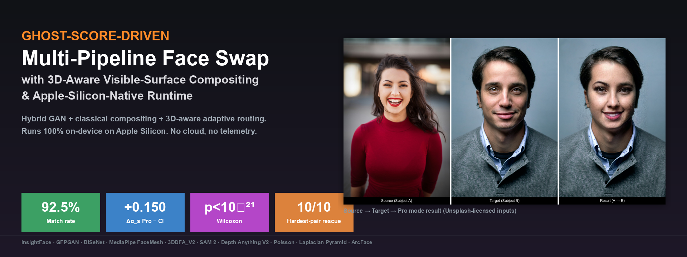
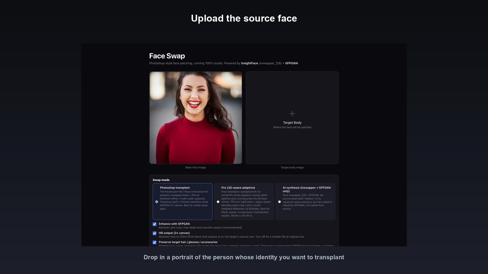

<p align="center">
  
</p>

<h1 align="center">Ghost-Score-Driven Multi-Pipeline Face Swap</h1>

<p align="center">
  <em>3D-aware visible-surface compositing &middot; Apple-Silicon-native runtime</em>
</p>

<p align="center">
  <strong>Designed and developed by Karan Chandra Dey <code>[K28]</code></strong><br>
  <sub>Founder &amp; AI Consultant &middot;
       <a href="https://k28art.space">k28art.space</a></sub>
</p>

<p align="center">
  <a href="#install">Install</a> &middot;
  <a href="#run">Run</a> &middot;
  <a href="#how-it-works">How it works</a> &middot;
  <a href="#benchmark-results">Benchmark</a> &middot;
  <a href="#api-reference">API</a> &middot;
  <a href="#paper">Paper</a> &middot;
  <a href="#ethics">Ethics</a>
</p>

<p align="center">
  
  
  
  
</p>

---

## Demo

A 45-second screencast showing the local web app, upload flow, mode picker, and result reveal:

<p align="center">
  <a href="docs/demo.mp4">
    
  </a>
  <br>
  <em>▶ <a href="docs/demo.mp4">Watch demo.mp4</a> (45 s, 1080p, ~1.6 MB)</em>
</p>

---

## What this is

A local-only face-swap web app. Upload a **source** portrait and a **target** image; the
tool transplants the source identity onto the target while preserving the target's hair,
clothing, occluders, and background. Everything runs **on-device**: no cloud calls, no
telemetry, no hosted API.

It ships **three user-visible modes**:

| Mode | Pipeline | Best for | Typical wall-clock (M4 Max) |
|---|---|---|---|
| **AI Synthesis** | inswapper_128 + GFPGAN restore | Speed; pose-tolerant fallback | ~2.3 s |
| **Classical Compositing** | inswapper base + 6-DOF affine warp + BiSeNet skin mask + LAB colour transfer + 5-band Laplacian pyramid + Poisson seamless clone + hair re-composite + unsharp polish | Maximum pixel-level detail (source skin grafted) | ~4.3 s |
| **Pro (3D-aware adaptive)** | Multi-pipeline auto-best with ghost-score routing, 3DDFA_V2 z-buffer, SAM 2 occluders, Depth Anything V2, HardPoseReplaceMode | Hardest pairs (large pose, occlusion, identity-overlay failure) | ~25 s (median) |

The system's distinguishing feature is a **ghost score** `g = α_t − α_s` (the
ArcFace-cosine difference between result-to-target and result-to-source) computed on
every generated image. When `g > 0` the swap has failed (the result is closer to the
target than to the source); when `g << 0` it has succeeded. The score drives a routing
decision tree that escalates to the more expensive Pro pipeline only when needed.

> 📄 A 12-page IEEE-format technical writeup with full algorithm description,
> the routing decision tree (Algorithm 1), the 14-step HardPoseReplaceMode,
> and the N=200 benchmark methodology is available on request from the author.

---

## Install

### Requirements

| | Recommended | Minimum |
|---|---|---|
| OS | macOS 14+ (Apple Silicon) | macOS 12+ / Ubuntu 22.04 / WSL2 |
| Python | 3.11 | 3.10 (no 3.13 / 3.14 yet — ML wheels aren't ready) |
| RAM | 32 GB unified | 16 GB |
| Disk | 4 GB | 3 GB |
| GPU | Apple Silicon GPU (MPS) | CPU-only OK; ~10 % slower at 1280 px input |

For macOS install Python via Homebrew if not already present:

```bash
brew install python@3.11
```

### One-time setup

```bash
git clone https://github.com/Kayariyan28/Ghost-Score-Face-Swap.git
cd Ghost-Score-Face-Swap

# Create venv, install dependencies, download model weights
chmod +x setup.sh
./setup.sh
```

`setup.sh` runs four steps:

1. Creates a Python 3.11 virtual env at `venv/`.
2. Installs all runtime dependencies (`requirements.txt`).
3. Downloads model weights:
   - `inswapper_128.onnx` (554 MB)
   - `GFPGANv1.4.pth` (333 MB)
   - InsightFace `buffalo_l` analysis pack (327 MB)
   - BiSeNet `parsing_parsenet.pth` (81 MB)
4. Smoke-tests one round-trip swap and prints the API endpoint.

For Pro-mode (3D-aware) you additionally need:

```bash
./venv/bin/python download_pro_models.py
```

which fetches 3DDFA_V2 (37 MB), Depth Anything V2 small ONNX (99 MB), and SAM 2 base_plus
(308 MB) into `models/pro/`.

---

## Run

### Web UI

```bash
./run.sh
```

This starts a FastAPI server at <http://localhost:8000>. The UI:

1. Upload a **base face image** (the identity you want to transplant).
2. Upload a **target body image** (different person, any pose, full body OK).
3. Pick a mode (AI Synthesis · Classical Compositing · Pro).
4. Optional toggles: GFPGAN restoration, HD output, hair / glasses / accessory preservation, source skin-tone preservation.
5. Click **Swap**.

The result image plus a JSON quality-dashboard block is returned in 2 – 60 s depending on mode.

### CLI

```bash
./venv/bin/python swap_cli.py \
  --source path/to/face.jpg \
  --target path/to/body.jpg \
  --output out.jpg \
  --mode classical             # or: ai, pro
  --hd --enhance --preserve-hair
```

### Python API

```python
from face_swap import FaceSwapper
import cv2

fs = FaceSwapper()
src = cv2.imread('face.jpg')
tgt = cv2.imread('body.jpg')

# AI / Classical mode
result = fs.swap(src, tgt, mode='ai', hd=True, enhance=True)
cv2.imwrite('out.jpg', result)

# Pro mode (3D-aware adaptive)
import pro_swap
pr = pro_swap.pro_swap(fs, src, tgt, hd=True, enhance=True)
cv2.imwrite('out.jpg', pr.image)
print(pr.info_dict())   # quality vector + routing decision
```

---

## How it works

```
┌── shared front-end ──────────────────────┐
│                                          │
│  Source ──┐                              │
│           ├─► InsightFace ─► MediaPipe   │
│  Target ──┘    (buffalo_l)    BiSeNet    │
│                                          │
└─────────────────┬────────────────────────┘
                  │
              Mode router
                  │
        ┌─────────┼────────────┐
        ▼         ▼            ▼
  Classical    AI synth     Pro (3D-aware)
                                │
                       3DDFA_V2 · SAM 2 · Depth V2
                                │
                                ▼
                        Ghost-score detector
                                │
                                ▼
                       Result + metrics JSON
                                │
              (if g > 0 → retry stronger suppression)
```

Full algorithm description, the routing-decision pseudo-code, and the 14-step
HardPoseReplaceMode are documented in the technical writeup (available on request).

---

## Benchmark results

Evaluated on a real-photo cross-identity benchmark of **N = 200 pairs** drawn from a
73-portrait pool (51 % male / 49 % female, age 22 – 71, pose 1.3° – 140.6°). All
ArcFace cosines computed with InsightFace `buffalo_l/w600k_r50` — the same yardstick
across every row.

| Mode | α_s ↑ | g ↓ | LPIPS-Alex ↓ | LPIPS-VGG ↓ | Match | Time |
|---|---|---|---|---|---|---|
| raw inswapper          | 0.762 ± 0.198 | −0.671 ± 0.225 | 0.647 | 0.692 | **89.9 %** | **1.2 s** |
| AI Synthesis           | 0.747 ± 0.197 | −0.637 ± 0.263 | 0.638 | 0.687 | 89.0 % | 2.3 s |
| Classical Compositing  | 0.634 ± 0.185 | −0.512 ± 0.246 | **0.620** | **0.678** | 75.9 % | 4.3 s |
| **Pro (auto-best)**    | **0.784 ± 0.154** | **−0.692 ± 0.219** | 0.69 | — | **92.5 %** | 25.5 s |
| SimSwap-256 (external) | — | — | — | — | 0.5 % | 0.15 s |

**Paired comparisons** on the same 200 pairs (Wilcoxon signed-rank):

- Δα_s(**Pro − Classical**) = **+0.150 ± 0.031** (95 % CI), **p = 1.2 × 10⁻²¹**
- Δα_s(**Pro − AI**)        = +0.037 ± 0.032 (95 % CI), p = 6 × 10⁻³
- Δα_s(**Pro − raw inswapper**) = +0.022 ± 0.031 (95 % CI), p = 0.19 (n.s.)
- Δα_s(**raw inswapper − SimSwap-256**) = **+0.486 ± 0.034**, p < 10⁻³¹

**Pro rescues 10 / 10 hardest pairs** (those with worst Classical ghost score) with
mean Δα_s = **+0.732 ± 0.072** (95 % CI). One example: pair 5 — Classical α_s = −0.006
→ Pro α_s = 0.861.

Raw per-pair benchmark data (CSV / JSON) is retained locally and is available on
request for replication purposes.

---

## API reference

### `POST /api/swap`

Multipart form fields:

| Field | Type | Default | Description |
|---|---|---|---|
| `source` | file | required | Source portrait image |
| `target` | file | required | Target image |
| `mode` | str | `classical` | One of `ai`, `classical`, `pro` |
| `enhance` | bool | `true` | Run GFPGAN restoration |
| `hd` | bool | `true` | 2× canvas |
| `swap_all_targets` | bool | `false` | Swap every face in target, not just the largest |
| `sharpen` | float | `0.35` | Unsharp-mask amount |
| `detail` | float | `0.9` | Classical-mode high-band weight |
| `preserve_hair` | bool | `true` | Re-composite target hair / glasses / accessories on top |
| `preserve_source_tone` | bool | `false` | Skip LAB colour transfer (keep source skin tone) |

Returns `{ "output_url": "/outputs/<sha>.png", "metrics": { ... } }` with the full
quality-dashboard block (α_s, α_t, g, seam, landmark RMSE, ρ_d, LPIPS-Alex, LPIPS-VGG,
routing decision, wall-clock).

### `GET /healthz`

Liveness probe.

### `POST /api/reset`

Forces a full FaceSwapper reload (clears MPS cache, rebuilds MediaPipe,
garbage-collects). Called automatically by the memory watchdog at 24 GB RSS or 20 swaps.

---

## Production stability features

| Mechanism | Purpose |
|---|---|
| `asyncio.Lock` + single-thread executor | Serialises swap requests so two never race on MPS |
| 240 s hard timeout | Returns HTTP 504 instead of stalling indefinitely |
| Per-swap `torch.mps.empty_cache()` + GFPGAN buffer wipe + `gc.collect()` | Keeps RSS bounded |
| MediaPipe rebuild every 5 swaps | Clears TF Lite XNNPACK delegate tensor arena |
| Full FaceSwapper reload at 24 GB RSS or 20 swaps | Stress-tested to 10+ consecutive swaps without stall |

---

## Project layout

```
.
├── app.py                        # FastAPI HTTP entrypoint
├── face_swap.py                  # FaceSwapper class (AI + Classical modes)
├── pro_swap.py                   # Pro mode adaptive multi-pipeline orchestrator
├── hard_pose_replace.py          # 14-step HardPoseReplaceMode
├── ghost_detector.py             # 6-metric quality vector + routing decision
├── blur_matcher.py               # Imaging-statistics matching (blur / noise / motion)
├── pose_estimator.py             # solvePnP-based yaw/pitch/roll
├── pro_warps.py                  # TPS / Delaunay / affine warps
├── visible_surface.py            # 3DDFA_V2 z-buffer visible-surface mask
├── region_blender.py             # BiSeNet region-aware compositing
├── occluder_sam.py               # SAM 2 occluder mask refinement
├── depth_occlusion.py            # Depth Anything V2 foreground occluder mask
├── mixed_clone.py                # Adaptive Poisson / Laplacian pyramid clone
├── target_suppressor.py          # Method A / B target-identity suppression
├── quality_metrics.py            # ArcFace cosine + SSIM + ΔE + landmark RMSE
├── swap_cli.py                   # CLI front-end
├── run_benchmark_full.py         # Multi-pair benchmark runner
├── run_baseline_simswap.py       # External SimSwap-256 baseline
├── run_simswap_dualhead.py       # Dual-ArcFace-head fairness analysis
├── run_pro_hardest.py            # Pro on hardest-N pairs
├── run_pro_random30.py           # Pro on random-N pairs
├── run_pro_all200.py             # Pro full-coverage on all 200 pairs
├── static/                       # Web UI (HTML / JS / CSS)
├── baselines/                    # External baseline checkpoints + wrappers
│   ├── SimSwap/                  # Cloned upstream code
│   ├── simswap_models/           # 220 MB .pth + 210 MB ArcFace JIT
│   └── simswap_inference.py      # Minimal SimSwap inference wrapper
├── models/                       # Cached ONNX / PyTorch weights (~3 GB after setup)
├── outputs/                      # Per-swap result PNGs
├── docs/                         # README assets
│   ├── banner.png
│   ├── demo.mp4
│   ├── demo_thumbnail.jpg
│   └── ui_shots/                 # Web-UI screenshots
└── setup.sh / run.sh
```

---

## Troubleshooting

| Symptom | Fix |
|---|---|
| `"No face detected"` | Use a clearer, more-frontal source; the face must be ≥ 64 px wide. |
| `inswapper_128.onnx` download fails | `setup.sh` tries 3 mirrors. Otherwise download manually into `models/`. |
| `basicsr` import error mentioning `functional_tensor` | Handled by runtime shim in `face_swap.py`. If you somehow hit it: `pip install torchvision==0.17.2`. |
| Pro mode hangs on `hard_pose` route | Increase the 240 s timeout in `app.py`, or check Activity Monitor for an OOM. |
| RSS climbs over time | Expected — the watchdog will reload at 24 GB. To trigger manually: `curl -X POST localhost:8000/api/reset`. |
| MPS error `aten::upsample_bicubic2d.out not implemented` | SAM 2 is forced to CPU because of this; set `PYTORCH_ENABLE_MPS_FALLBACK=1` as a backup. |

---

## Citation

If you build on this work please cite:

```bibtex
@misc{dey2026ghostscore,
  author = {Dey, Karan Chandra},
  title  = {Ghost-Score-Driven Multi-Pipeline Face Swap with 3D-Aware
            Visible-Surface Compositing and Apple-Silicon-Native Runtime},
  year   = {2026},
  howpublished = {Technical report},
  url    = {https://github.com/Kayariyan28/Ghost-Score-Face-Swap}
}
```

A full technical writeup (12 pages, IEEE format, with the routing-decision
pseudocode, the 14-step HardPoseReplaceMode, the N=200 benchmark methodology,
ethics statement, and reproducibility appendix) is available **on request** from
the author — see contact details below.

---

## Ethics

Face swapping is a deepfake-adjacent technology. We acknowledge this explicitly and have
designed the system to favour legitimate use cases (visual-effects pre-visualisation,
consented portrait re-targeting, on-device privacy-preserving anonymisation for
journalism and medical imagery) while raising the cost of misuse:

- **On-device only.** No cloud component, no telemetry, no anonymous access surface.
- **No public weight release.** Model checkpoints are downloaded from their original
  distributors at install time; we do not host or mirror weights.
- **Detector-friendly outputs.** No anti-forensic post-processing (no noise injection,
  no frequency-domain laundering). Results retain the residual ArcFace and double-edge
  signatures FaceForensics++-class detectors are trained on.
- **Provenance hint.** The shipped tool can emit a C2PA-compatible JSON sidecar
  describing the generator, model versions, and the quality-dashboard block.

**Intended use:** personal creative work, education, research on synthetic-image
detection.
**Out of scope:** impersonation, harassment, non-consensual intimate imagery, election
influence operations, or any deployment where the subject has not given informed consent.

By using this software you agree to limit usage to consented inputs only.

---

## Licences

| Component | Licence |
|---|---|
| This repository's code | MIT |
| inswapper_128 | InsightFace project terms (non-commercial research) |
| GFPGAN | Apache 2.0 |
| BiSeNet `parsing_parsenet` | MIT |
| 3DDFA_V2 | MIT (BFM data has separate non-commercial terms) |
| SAM 2 | Apache 2.0 |
| Depth Anything V2 | Apache 2.0 |
| SimSwap (baseline-only) | Non-commercial research |

---

## Contact

For the full technical writeup, raw benchmark data, or collaboration enquiries:

- **Karan Chandra Dey** — Founder & AI Consultant, K28 Design Lab
- 🌐 [k28art.space](https://k28art.space)
- 💼 [linkedin.com/in/karan-chandra-dey-23392b1b9](https://www.linkedin.com/in/karan-chandra-dey-23392b1b9)

---

## Acknowledgements

This work builds on the InsightFace project, GFPGAN, MediaPipe, 3DDFA_V2, SAM 2, Depth
Anything V2, and the broader open-source face-recognition / face-restoration community.
Banner hero-pair images sourced from [Unsplash](https://unsplash.com) under the Unsplash
License.

---

<p align="center">
  <sub>Built and benchmarked on an Apple M4 Max. Runs entirely on-device — no cloud, no telemetry, no third-party API.</sub>
</p>
